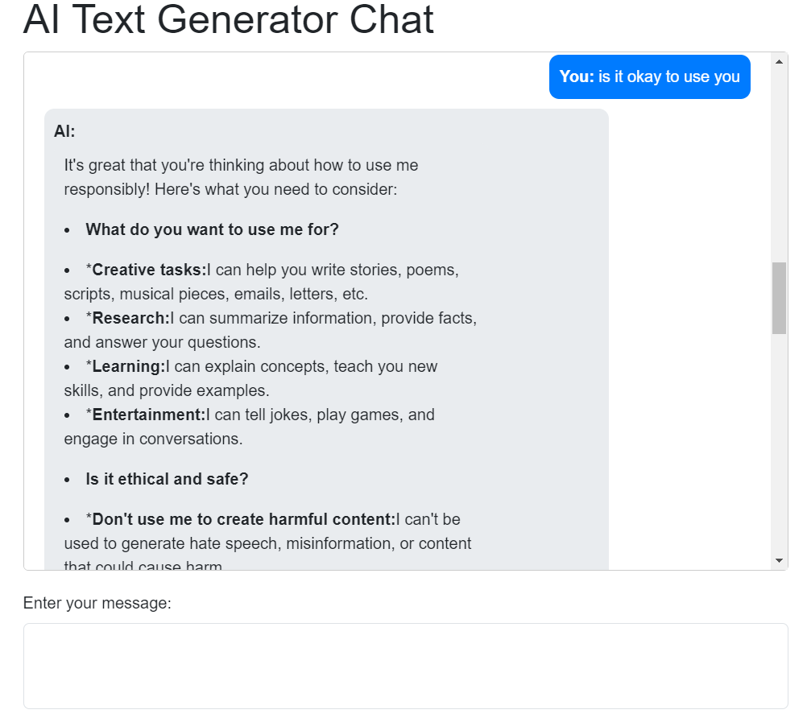

Here’s the entire README content in code format, including the MIT License:

# Flask Chatbot with Google Generative AI

This project is a simple chatbot application built using Flask, which integrates with Google Generative AI to generate responses based on user input. The application stores chat history in a JSON file, allowing for a persistent chat experience.

## Features

- User-friendly web interface for chatting.
- Integration with Google Generative AI to generate dynamic responses.
- Persistent chat history stored in a JSON file.
- Simple setup and deployment.

## Technologies Used

- Flask: A lightweight WSGI web application framework.
- Google Generative AI: For generating responses.
- HTML/CSS: For frontend design.
- JSON: For storing chat history.

## Requirements

- Python 3.x
- Flask
- google-generativeai library

## Installation

1. Clone the repository:

   ```bash
   git clone https://github.com/prakriti16/temp.git
   cd temp
   ```

2. Install the required packages:

   ```bash
   pip install Flask google-generativeai
   ```

3. Set your Google API Key in the `app.py` file:

   ```python
   GOOGLE_API_KEY = 'YOUR_API_KEY'  # Replace with your actual API key
   ```

## Usage

1. Run the Flask application:

   ```bash
   python app.py
   ```

2. Open your web browser and go to `http://127.0.0.1:5000/`.

3. Start chatting with the bot!

## Demo



## File Structure

```
.
├── app.py                  # Main application file
├── chat_history.json       # File to store chat history
└── templates
    └── index.html          # HTML template for the chat interface
```

## Contributing

Contributions are welcome! If you have suggestions or improvements, feel free to open an issue or submit a pull request.

## Acknowledgments

- Thanks to Google for providing the Generative AI API.
- Flask for the lightweight web framework.
